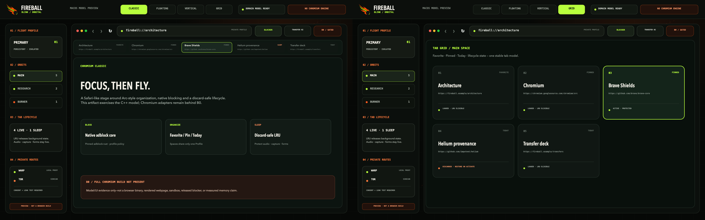

# fireball-blink

Buildable B0/B1 tooling foundation for the Chromium-based Fireball Browser, featuring the desktop Chromium engine, the native **Fireball Mini for Android** mobile browser, and the **WebExtension Companion**.


The detached meteor mark is the shared Fireball identity: an obsidian core, ember-orange flight surfaces and one electric-lime trail. Blink applies it to an **orbital command deck**—dense desktop chrome, explicit Profile/Space boundaries and visible provenance—without pretending this preview is a browser.

<a href="docs/assets/fireball-blink-layout-showcase.png">
  
</a>


<sub>Classic and Grid presentations share one domain model; Transfer Deck is a separate model preview. These images do not claim a Chromium browser build.</sub>

---

## 📱 Fireball Mini for Android (Mobile Edition)

**Fireball Mini** (`fireball-mini/`) is the lightweight, battery-efficient, privacy-first mobile browser for Android (API 26+ / Android 8.0 through Android 15). It combines a modern **Jetpack Compose / Material Design 3 (Material You)** interface with a hardened **C++ / Rust Native Engine (Android NDK)**.

<div align="center">
  
</div>

### 🌟 Key Capabilities & Features

#### 1. 🪐 Multi-Tiered Spaces & Tabs (Orbital Deck Model)
- **Spaces & Profiles**: Isolate browsing contexts (Personal, Work, Shopping, etc.) with independent cookie jars and storage.
- **Three-Tier Tab Lifecycle**:
  - **⭐ Favorites**: Profile-wide essential tabs accessible across all Spaces.
  - **📌 Pinned Tabs**: Long-lived tabs anchored to specific Spaces.
  - **🕘 Today Tabs**: Daily browsing tabs with configurable Auto-Archive after inactivity.
- **🔥 Burner Space**: Ephemeral, strictly off-the-record incognito container that nukes all tabs, cache, and history upon closing.
- **💤 Smart RAM Saver (LRU Discard)**: Automatically suspends inactive background WebViews under memory pressure while retaining tab titles, URLs, and scroll state.

#### 2. 🛡️ Native Fireball Shields & Privacy Protection
- **Rust Adblock Engine**: Panic-safe FFI binding to `adblock-rust` 0.13.2 with compiled EasyList & EasyPrivacy rules.
- **Cosmetic Filtering**: Real-time CSS injection hiding ad placeholders and layout shifts without breaking webpage DOM structure.
- **Strict URL Cleaner**: Automatically strips tracking parameters (`utm_*`, `fbclid`, `gclid`, `mc_eid`, `ref`, etc.) on all navigations.
- **Flexible Filter Controls**: 6 toggleable shield engines (Trackers & Ads, HTTPS Upgrades, Anti-Fingerprinting, Cosmetic Filtering, Script Blocker, Cross-Site Cookie Isolation).

#### 3. 🔄 Cross-Browser Sync (Firefox & Brave Parity)
- **Brave Sync v2 & Firefox Sync Integration**:
  - 24-word BIP-39 mnemonic sync chain derivation.
  - PBKDF2 / SHA-256 HKDF key generation for cross-device authentication.
  - Device pairing via QR Code and sync phrase.
- **End-to-End Encrypted (E2EE) Backup**: AES-GCM-256 encrypted bookmark and open tab exports with password protection.
- **Standard HTML Bookmarks**: Full import/export support for Chromium/Firefox standard Netscape HTML bookmarks.

#### 4. 🤖 Fireball AI Assistant & Distraction-Free Reader Mode
- **Local Article Extractor**: In-browser Readability engine that cleans noise, sidebars, and ads into a pure typography reading view.
- **AI Summary & Key Takeaways**: Generates concise reading stats, estimated reading times, and structured bullet takeaways.
- **Multi-turn Chat**: Interactive contextual chat with page content.
- **Text-to-Speech (TTS)**: Built-in floating audio player with customizable reading speeds (0.75x to 2.0x).

#### 5. 🎬 Media Sniffer & Multi-Threaded Transfer Deck
- **Smart Stream Sniffer**: Automatically detects streaming video and audio:
  - **HLS Adaptive Streams (`.m3u8`)**
  - **DASH Streams (`.mpd`)**
  - **Direct MP4 / WebM / MP3 / OGG**
- **Quality Track Selector**: Choose resolution, bitrate, and format before downloading.
- **Resumable Downloads**: Multi-connection parallel chunk downloads with pause/resume support.

#### 6. 🌐 Privacy Egress Routing
- Profile-level switching between:
  - **Direct**: Standard local network interface.
  - **Cloudflare WARP**: Encrypted egress proxy.
  - **Tor Onion Circuit**: Anonymous multi-hop SOCKS5 routing.

#### 7. 📱 Material Design 3 & Multi-Form-Factor Layouts
- **Material 3 (M3) Standards**: Strict adherence to Google Material You guidelines, dynamic surfaces, and safe edge-to-edge system insets (`statusBarsPadding()`, `navigationBarsPadding()`).
- **Responsive Form Factors**: Optimized for Phones, Foldables, Tablets (with dedicated **Tablet Tab Strip**), and Desktop/PC mode.
- **Ergonomic Touch Targets**: Minimum $\ge 48\text{dp}$ touch targets for effortless one-handed use.

### 🔨 Building & Running Fireball Mini

```bash
cd fireball-mini

# Run the complete Android unit test suite (42/42 tests passing)
./gradlew testDebugUnitTest

# Assemble Debug APK
./gradlew assembleDebug

# Install and launch on connected Android device or Emulator
./gradlew installDebug
adb shell am start -n com.fireball.mini/.MainActivity
```
Output APK: `fireball-mini/app/build/outputs/apk/debug/app-debug.apk`.

---

## 🧩 WebExtension Companion

Located in `fireball-extension/`, the **Fireball WebExtension Companion** is a Manifest V3 / V2 compatible extension for Chromium browsers (Brave, Chrome, Edge) and Mozilla Firefox:
- **Bi-directional Sync**: Syncs tabs, history, and bookmarks between desktop browsers and Fireball Mini.
- **Native Messaging Bridge**: Communicates with the local Fireball desktop core or Android device via encrypted WebSocket/WebRTC sync channels.

---

## 🖥️ macOS Model Preview (Blink Desktop)

The repository includes a buildable AppKit preview that drives its four tab presentations from the real C++ `BrowserModel`:

| Chromium Classic | Safari Floating |
| --- | --- |
|  |  |
| Vertical Sidebar | Tab Grid |
|  |  |

```sh
make macos-preview
open "out/macos-preview/Fireball Blink Preview.app"
```

This is deliberately a **model/UI preview, not a Chromium browser build**. It contains no Chromium checkout, WebContents, renderer, sandbox, extensions, adblock engine, or URL cleaner. See [the reproducible preview and promotion rules](docs/MACOS_PREVIEW.md).

The product-specific UI tokens and component rules live in [`design-system/fireball-blink/MASTER.md`](design-system/fireball-blink/MASTER.md), with preview overrides in [`pages/browser-shell.md`](design-system/fireball-blink/pages/browser-shell.md).

---

## 🏛️ Architecture Boundary

- Chromium Stable Linux `151.0.7922.169` and `depot_tools` are locked to exact official revisions in `pins/upstream.json`.
- Product code starts in the `fireball/` GN overlay.
- Chromium-relative overrides live in `chromium_src/` only when an overlay seam is insufficient.
- Direct patches are last-resort entries in `patches/manifest.json`.
- `overlay/manifest.json` checksum-pins the complete staged Fireball GN tree; the protected B1 [component-link gate](docs/CHROMIUM_OVERLAY_BUILD.md) refuses unmanaged overrides or stale bytes. The graph includes [Chromium request adapters](docs/CHROMIUM_NAVIGATION_ADAPTER.md): Profile-owned policy bundle, primary-main-frame `NavigationThrottle`, sequence-safe subresource `URLLoaderThrottle`, typed [renderer stylesheet endpoint](docs/CHROMIUM_COSMETIC_ADAPTER.md), and BFCache-aware lifecycle owner.
- PartitionAlloc, Chromium's process model and sandbox remain intact.

`make check` validates upstream/reference pins, the checksum-pinned overlay tree, generated network and URL Cleaner policy data, exercises apply/reverse fixtures, compiles standalone C++ policy/domain tests, and links the C++ request pipeline to the real Rust blocker ABI.

---

## 🔒 Brave and Helium Reference Policy

`pins/reference-browsers.json` records the exact reviewed snapshots. Brave supplies the overlay → override → direct-patch ordering and rebase discipline. Helium supplies the vendor-sorted patch-series, pruning and download-checksum provenance patterns.

---

## 🌐 Startup Network Policy

`policies/startup_network.json` is default-deny and contains no allowed startup traffic. Its post-startup rules cover only user-initiated aria2, WARP and Tor activation, each with explicit consent. `tools/network_policy.py` generates the C++ table used by the overlay and CI rejects stale generated output or unknown schema fields.

---

## 🛡️ Security Rebase Gate

`security/rebases.json` is the evidence ledger for the 72-hour Chromium security-rebase SLA. Passing and failed attempts are both recorded so a failure breaks the consecutive-pass streak.

---

## 🪐 Profiles, Spaces and Burner State

`fireball/browser/domain_model.*` establishes the B2 ownership boundary:
- **Profile** owns persistent or off-the-record storage identity.
- **Space** owns a tab collection and points to exactly one Profile.
- **Tab** has a stable UUID.
- Multiple regular Spaces can share a persistent Profile; Burner Spaces require an off-the-record Profile and cannot be restored.

See [the tab-management and Chromium adapter contract](docs/TAB_MANAGEMENT.md).

---

## 🛑 Native Adblock Foundation

`fireball/components/adblock` contains a real, pinned `adblock-rust` 0.13.2 engine behind a panic-contained C ABI plus a C++ per-profile policy boundary. Network rules, exceptions, third-party matching, site-specific cosmetic rules and generic class/ID selectors are exercised through the actual engine. See [the cosmetic filtering contract](docs/COSMETIC_FILTERING.md) and [the signed rule artifact contract](docs/ADBLOCK_RULE_ARTIFACTS.md).

---

## 🧭 Profile Request Pipeline

`fireball/components/navigation` combines strict request validation, versioned URL cleaning, the per-Profile blocker policy and the committed Direct/WARP/Tor route into one deterministic decision. See [the URL Cleaner data contract](docs/URL_CLEANER_RULES.md) and [the request pipeline contract](docs/REQUEST_PIPELINE.md).

---

## 📦 Download and Transfer Foundation

`fireball/components/transfer` contains the production transfer vertical slice:
- Accepts HTTP(S), canonical BitTorrent v1 magnet links, `.torrent` metainfo.
- Classifies direct audio/video and HLS/DASH candidates.
- Controls a foreground aria2 sidecar via typed JSON-RPC with 4 range connections and monotonic state transitions.
- See [the transfer architecture contract](docs/TRANSFERS.md).

---

## ⚡ WARP and Tor Egress Foundation

`fireball/components/egress` defines profile-scoped Direct, WARP and Tor routes, a transaction controller, a loopback SOCKS5 readiness probe and an ephemeral Tor sidecar. See [`docs/EGRESS.md`](docs/EGRESS.md).
