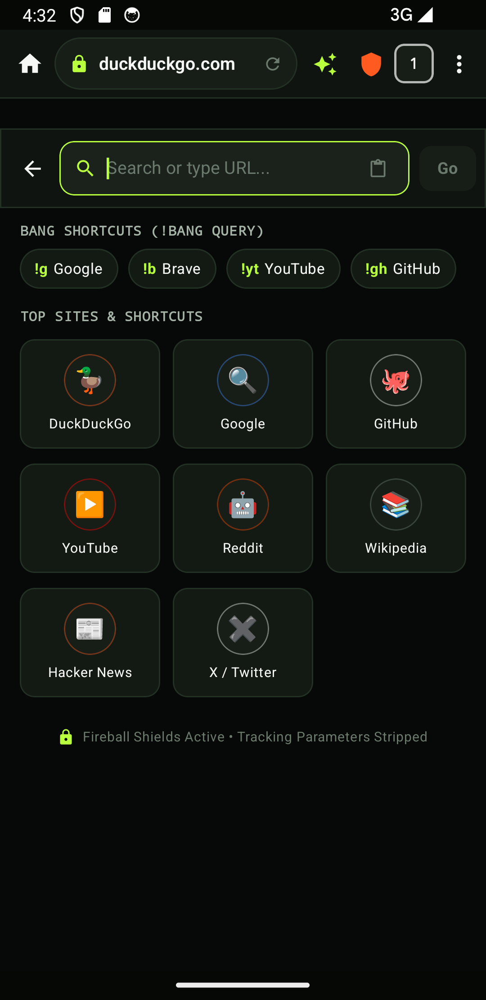
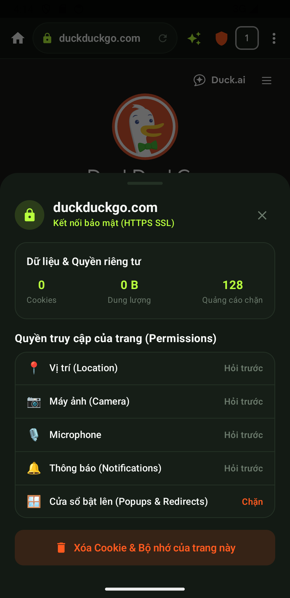
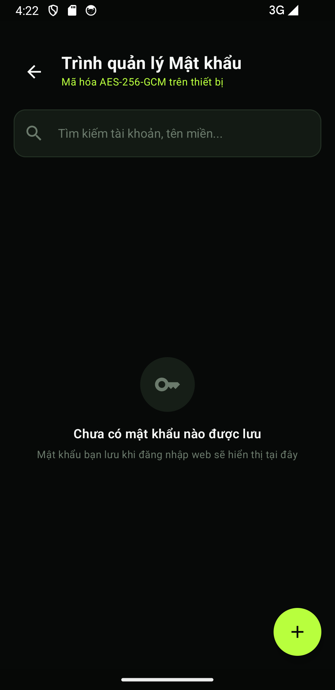
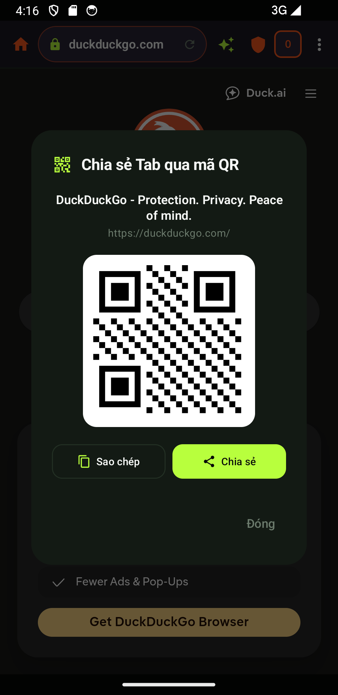
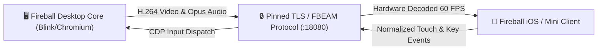

# Fireball Browser Ecosystem

A privacy-centric, multi-tier browser ecosystem structured into 3 distinct pillars:

| Pillar | Product | Target Platforms | Engine & Stack | Key Highlights |
|---|---|---|---|---|
| **Pillar 1** | [**🔥 Fireball Server**](fireball-server/) | **Windows, macOS, Linux, Docker** | Python, CDP, XVFB, Docker | Headless streaming daemon (`FBEAM` / HTTP), BIP-39 sync hub, Tor/WARP egress, 1-click Docker Compose |
| **Pillar 2** | [**⚡ Fireball Mini Browser**](fireball-mini/) | **Android, Windows, iOS, Java ME** | Native OS WebViews & Thin Streamers | Sub-5MB to <60KB, <60MB to <1.5MB RAM, Multi-Space isolation, Shields, Zero-Knowledge Vault |
| **Pillar 3** | [**🌐 Fireball Browser**](docs/FIREBALL_BROWSER_FULL.md) | **Android, Windows, macOS, Linux** | Full Chromium / Blink Engine Overlay (GN/Ninja) | Hardened default-deny network policy, `adblock-rust` FFI, HLS/DASH aria2 transfers, Orbital Command Deck |
| **Companion** | [**🧩 Fireball Extension**](fireball-extension/) | **Chrome, Brave, Edge, Firefox, Opera** | Manifest V3 / WebAssembly | 7 auxiliary modules: Fireball Sync, Shield, Media Downloader, Authenticator, Reader, Remote Browser, Retro Player |

---

## 📂 Sơ Đồ Cấu Trúc Mã Nguồn (Repository Layout)

```
fireball-blink/
├── ⚡ fireball-mini/          # 1. Fireball Mini Browser (Đầy đủ 4 nền tảng)
│   ├── app/                 #    - Android Edition (Kotlin, Jetpack Compose, WebView, NDK)
│   ├── windows/ (win/)      #    - Windows Edition (C++20, Win32, MS Edge WebView2)
│   ├── ios/                 #    - iOS Edition (SwiftUI, WebKit, Stream Stage)
│   └── j2me/                #    - Java ME Edition (MIDP 2.0, LCDUI Canvas, TileCache)
│
├── 🧩 fireball-extension/     # 2. Fireball Extension (Bộ 7 tiện ích mở rộng Manifest V3)
│   ├── background/          #    - Fireball Sync & Fireball Shield Service Workers
│   ├── content_scripts/     #    - Fireball Media Downloader, Fireball Reader & Fireball Retro Player (Ruffle)
│   ├── lib/                 #    - Fireball Authenticator (AES-256-GCM / TOTP) & Fireball Remote Browser (FBEAM)
│   └── popup/               #    - Extension Popup & Teleport UI
│
├── 🌐 fireball/               # 3. Fireball Browser (Bản Full Chromium/Blink Engine GN Overlay)
│   ├── browser/             #    - Domain models, Multi-presentation tabs & Spaces
│   ├── components/          #    - adblock-rust FFI, navigation adapters, aria2 transfers, egress
│   └── app/                 #    - Application entrypoint and overlay integration
│
├── 🔥 fireball-server/        # 4. Fireball Server (Headless Streaming & Sync Daemon)
│   ├── beam_server.py       #    - Headless Chromium CDP controller & FBEAM streamer
│   ├── sync_relay.py        #    - BIP-39 WebRTC real-time sync signaling hub
│   ├── media_remuxer.py     #    - HLS/DASH chunk stitcher & MP4 converter
│   └── Dockerfile           #    - Multi-arch container image
│
└── 🛠️ tools/                  # 5. Bộ công cụ kiểm thử & đóng gói tự động
    └── package_ecosystem.py #    - One-click multi-platform release packager
```

---

<div align="center">
  
</div>


The detached meteor mark is the shared Fireball identity: an obsidian core, ember-orange flight surfaces and one electric-lime trail.

---

<a href="docs/assets/fireball-blink-layout-showcase.png">
  
</a>


<sub>Classic and Grid presentations share one domain model; Transfer Deck is a separate model preview. These images do not claim a Chromium browser build.</sub>

---

## 📱 Fireball Mini for Android (Mobile Edition)

**Fireball Mini** (`fireball-mini/`) is the lightweight, battery-efficient, privacy-first mobile browser for Android (API 26+ / Android 8.0 through Android 15). It combines a modern **Jetpack Compose / Material Design 3 (Material You)** interface with a hardened **C++ / Rust Native Engine (Android NDK)**.

<div align="center">
  
</div>

### 📸 Live Android Showcase & Screenshots

| 🪐 Multi-Tiered Tab & Spaces Tray | 🛡️ Fireball Shields & Adblock Engine |
| :---: | :---: |
|  |  |
| **Spaces, Favorites, Pinned & Today Tabs** | **Rust Adblocker, Cosmetic Filters & Inset Safe** |

| 🔄 Cross-Browser Sync (Firefox/Brave) | 🤖 Fireball AI Assistant & Reader Mode |
| :---: | :---: |
|  |  |
| **24-Word BIP39 Chain & E2EE Key Derivation** | **Key Takeaways, Summary & Multi-Turn Chat** |

| 🎬 Media Sniffer & Video Downloads | ⚙️ Settings & Configuration Deck |
| :---: | :---: |
|  |  |
| **HLS / DASH Streams & Track Selection** | **M3 Touch Targets, Privacy & Sync Settings** |

| 🔍 Omnibox & Bang Shortcuts Engine | 🛡️ Site Security & Origin Storage Manager |
| :---: | :---: |
|  |  |
| **Instant Bangs (!g, !yt, !gh, !w, !k) & Quick Sites** | **HTTPS TLS Inspector, Origin Cookies & Permissions** |

| 🔐 AES-256 Encrypted Password Vault | 📷 Procedural QR Code Tab Sharing |
| :---: | :---: |
|  |  |
| **Device-Derived AES-GCM-256 Password Manager** | **Live Tab QR Generator & System Share Intent** |

---

### 🌟 Key Capabilities & Features

#### 1. 🪐 Multi-Tiered Spaces & Tabs (Orbital Deck Model)
- **Spaces & Profiles**: Isolate browsing contexts (Personal, Work, Shopping, etc.) with independent cookie jars and storage.
- **Three-Tier Tab Lifecycle**:
  - **⭐ Favorites**: Profile-wide essential tabs accessible across all Spaces.
  - **📌 Pinned Tabs**: Long-lived tabs anchored to specific Spaces.
  - **🕘 Today Tabs**: Daily browsing tabs with configurable Auto-Archive after inactivity.
- **🔥 Burner Space**: Ephemeral, strictly off-the-record incognito container that nukes all tabs, cache, and history upon closing.
- **💤 Smart RAM Saver (LRU Discard)**: Automatically suspends inactive background WebViews under memory pressure while retaining tab titles, URLs, and scroll state.

#### 2. 🛡️ Native Fireball Shields & Privacy Protection
- **Rust Adblock Engine**: Panic-safe FFI binding to `adblock-rust` 0.13.2 with compiled EasyList & EasyPrivacy rules.
- **Cosmetic Filtering**: Real-time CSS injection hiding ad placeholders and layout shifts without breaking webpage DOM structure.
- **Strict URL Cleaner**: Automatically strips tracking parameters (`utm_*`, `fbclid`, `gclid`, `mc_eid`, `ref`, etc.) on all navigations.
- **Flexible Filter Controls**: 6 toggleable shield engines (Trackers & Ads, HTTPS Upgrades, Anti-Fingerprinting, Cosmetic Filtering, Script Blocker, Cross-Site Cookie Isolation).

#### 3. 🔄 Cross-Browser Sync (Firefox & Brave Parity)
- **Brave Sync v2 & Firefox Sync Integration**:
  - 24-word BIP-39 mnemonic sync chain derivation.
  - PBKDF2 / SHA-256 HKDF key generation for cross-device authentication.
  - Device pairing via QR Code and sync phrase.
- **End-to-End Encrypted (E2EE) Backup**: AES-GCM-256 encrypted bookmark and open tab exports with password protection.
- **Standard HTML Bookmarks**: Full import/export support for Chromium/Firefox standard Netscape HTML bookmarks.

#### 4. 🤖 Fireball AI Assistant & Distraction-Free Reader Mode
- **Local Article Extractor**: In-browser Readability engine that cleans noise, sidebars, and ads into a pure typography reading view.
- **AI Summary & Key Takeaways**: Generates concise reading stats, estimated reading times, and structured bullet takeaways.
- **Multi-turn Chat**: Interactive contextual chat with page content.
- **Text-to-Speech (TTS)**: Built-in floating audio player with customizable reading speeds (0.75x to 2.0x).

#### 5. 🎬 Media Sniffer & Multi-Threaded Transfer Deck
- **Smart Stream Sniffer**: Automatically detects streaming video and audio:
  - **HLS Adaptive Streams (`.m3u8`)**
  - **DASH Streams (`.mpd`)**
  - **Direct MP4 / WebM / MP3 / OGG**
- **Quality Track Selector**: Choose resolution, bitrate, and format before downloading.
- **Resumable Downloads**: Multi-connection parallel chunk downloads with pause/resume support.

#### 6. 🌐 Privacy Egress Routing
- Profile-level switching between:
  - **Direct**: Standard local network interface.
  - **Cloudflare WARP**: Encrypted egress proxy.
  - **Tor Onion Circuit**: Anonymous multi-hop SOCKS5 routing.

#### 7. 📱 Material Design 3 & Multi-Form-Factor Layouts
- **Material 3 (M3) Standards**: Strict adherence to Google Material You guidelines, dynamic surfaces, and safe edge-to-edge system insets (`statusBarsPadding()`, `navigationBarsPadding()`).
- **Responsive Form Factors**: Optimized for Phones, Foldables, Tablets (with dedicated **Tablet Tab Strip**), and Desktop/PC mode.
- **Ergonomic Touch Targets**: Minimum $\ge 48\text{dp}$ touch targets for effortless one-handed use.

#### 8. 🔍 Search Engine Provider & Bang Shortcuts Engine
- **Multi-Engine Switching**: Switch default search provider (DuckDuckGo, Google, Brave, Bing, Ecosia, Startpage, Kagi).
- **Bang Shortcuts Engine**: Instant Bang queries directly from the Omnibox or quick suggestion chips (`!g` for Google, `!gh` for GitHub, `!yt` for YouTube, `!w` for Wikipedia, `!k` for Kagi, `!r` for Reddit, etc.).
- **Custom Engine URL Templates**: Support for `%s` parameter search query URLs.

#### 9. 🛡️ Site Permissions & Origin Storage Manager
- **Site Security Inspector**: Interactive lock icon revealing HTTPS TLS certificate state, tracker block metrics, and connection security.
- **Granular Permissions**: Domain-level controls for Geolocation, Camera, Microphone, Notifications, and Popups.
- **Origin Storage Purge**: View domain-specific cookie and cache usage with one-tap instant data clearing.

#### 10. 🔐 Encrypted Password & Credential Vault (E2EE)
- **Zero-Knowledge Encryption**: AES-256-GCM authenticated encryption with device-derived master key seed.
- **Password Manager Screen**: Instant credential search, reveal/hide password toggles, clipboard copy helpers, and delete protections.
- **Manual Credential Creation**: Quick modal dialog to add and encrypt credentials for any domain.

#### 11. 📷 Procedural QR Code Tab Sharing
- **Instant QR Generator**: Procedural QR code generation for the active tab URL.
- **System Integration**: One-tap URL copying and native Android system share intent integration.

### 🔨 Building & Running Fireball Mini

```bash
cd fireball-mini

# Run the complete Android unit test suite (47/47 tests passing)
./gradlew testDebugUnitTest

# Assemble Debug APK
./gradlew assembleDebug

# Install and launch on connected Android device or Emulator
./gradlew installDebug
adb shell am start -n com.fireball.mini/.MainActivity
```
Output APK: `fireball-mini/app/build/outputs/apk/debug/app-debug.apk`.

---

## 🧩 WebExtension Suite & Companion Modules

Located in `fireball-extension/`, the **Fireball WebExtension Suite** is a modular Manifest V3 companion for Chromium browsers (Brave, Chrome, Edge, Opera, Vivaldi) and Mozilla Firefox:
- **1. Fireball Sync**: Đồng bộ hóa chuỗi 24 từ BIP-39 (Brave Sync v2), dịch chuyển tab tức thì qua phím tắt `Ctrl+Shift+Y`.
- **2. Fireball Shield**: Tự động cắt tỉa tham số theo dõi URL (`utm_*`, `fbclid`, `gclid`), chống WebRTC leak.
- **3. Fireball Media Downloader**: Tự động phát hiện và bắt link video trực tuyến **HLS (`.m3u8`)**, **DASH (`.mpd`)**, **MP4**.
- **4. Fireball Authenticator**: Két mật khẩu mã hóa AES-256-GCM và bộ tạo mã xác thực 2 bước (TOTP Authenticator).
- **5. Fireball Reader**: Trích xuất nội dung bài viết sạch (Readability), tóm tắt AI và đọc văn bản thành giọng nói (TTS).
- **6. Fireball Remote Browser**: Kết nối điều khiển và xem luồng duyệt web từ xa chạy trên Fireball Server (`FBEAM`).
- **7. Fireball Retro Player**: Giả lập Adobe Flash bằng WebAssembly (Rust/Ruffle) chơi game Flash cổ điển (`.swf`).


---

## 🍎 Fireball for iOS & iPadOS (Apple Edition)

Located in `fireball-ios/`, **Fireball iOS** is the native browser for iPhone and iPad built with **Swift 6 & SwiftUI**, supporting both native WebKit rendering and the Fireball Beam remote streaming protocol:

- **Orbital Spaces & Tabs**: Full 3-tier tab model (*Favorites, Pinned, Today, Burner*).
- **iPadOS & Mac Catalyst Tab Strip**: Dedicated horizontal tab strip with spaces switcher (`iPadTabStripView`).
- **Bang Shortcuts Engine**: Omnibox search with instant bang operators (`!g`, `!b`, `!yt`, `!gh`, `!w`, `!k`, `!sp`, `!e`, `!r`).
- **Encrypted Password Vault**: Device-derived AES-256-GCM zero-knowledge credential vault via Apple CryptoKit.
- **Fireball Shields**: Built-in tracking URL parameter cleaner, cosmetic ad filtering, and HTTPS upgrade engine.
- **Cross-Platform BIP-39 Sync**: Synchronizes with Fireball Mini (Android) and Fireball Desktop via 24-word sync phrases.

```bash
cd fireball-ios

# Run FireballCore Swift test suite (18/18 tests passing)
swift run FireballTestRunner

# Build SwiftUI user interface library
swift build --target FireballUI
```

---

## ⚡ Fireball Beam (Remote Browser Streaming Engine)

Located in `fireball-beam/`, **Fireball Beam** is a low-latency remote browser streaming daemon inspired by `seg6/surf`:



- **Offload Heavy Tabs**: Offload demanding JavaScript, WebGL, or desktop extensions from mobile to a host computer.
- **Chromium Native Tab Capture**: High-efficiency 60 FPS video and audio capture without virtual audio/video drivers.
- **Touch-to-Viewport Normalizer**: Translates device normalized touches (`0.0 - 1.0`) to host pixel viewport events.
- **Single-Use Pairing Protocol**: Cryptographic pairing via QR code or 6-word visual confirmation phrases.

```bash
# Run Beam protocol verification tests
python3 fireball-beam/test_beam_protocol.py
```

---

## 🖥️ macOS Model Preview (Blink Desktop)

The repository includes a buildable AppKit preview that drives its four tab presentations from the real C++ `BrowserModel`:

| Chromium Classic | Safari Floating |
| --- | --- |
|  |  |
| Vertical Sidebar | Tab Grid |
|  |  |

```sh
make macos-preview
open "out/macos-preview/Fireball Blink Preview.app"
```

This is deliberately a **model/UI preview, not a Chromium browser build**. It contains no Chromium checkout, WebContents, renderer, sandbox, extensions, adblock engine, or URL cleaner. See [the reproducible preview and promotion rules](docs/MACOS_PREVIEW.md).

The product-specific UI tokens and component rules live in [`design-system/fireball-blink/MASTER.md`](design-system/fireball-blink/MASTER.md), with preview overrides in [`pages/browser-shell.md`](design-system/fireball-blink/pages/browser-shell.md).

---

## ⚡ Fireball Mini Browser (4 Lightweight Editions)

### 1. 🤖 Android Edition (`fireball-mini/app/`)
- Kotlin + Jetpack Compose + Material Design 3 (Material You) + System Android WebView + NDK C++/Rust.
- Tablet Tab Strip, Phone bottom command capsule, AI Assistant, Live Tab Previews, HLS/DASH media stream sniffer.

### 2. 🪟 Windows Edition (`fireball-win/` or `fireball-mini/windows/`)
- Native C++20 / Win32 application utilizing Microsoft Edge WebView2 Evergreen.
- Sub-5MB executable, <60MB RAM, Multi-Space User Data Folder isolation (`Main`, `Work`, `Burner`), Zero-Knowledge Vault.

### 3. 🍎 iOS & iPadOS Streaming Edition (`fireball-ios/` or `fireball-mini/ios/`)
- Native SwiftUI & WebKit client with integrated Fireball Beam WebSocket streaming codec.
- Desktop-class iPadOS tab strip, Apple CryptoKit Vault, BIP-39 sync, and sub-10ms streaming touch dispatcher.

### 4. ☕ Java ME Edition (`fireball-j2me/` or `fireball-mini/j2me/`)
- MIDP 2.0 / CLDC 1.1 thin streaming client for feature phones, Symbian, and BlackBerry devices (<60KB JAR, <1.5MB RAM).
- Opera Mini-style remote rendering: receives compressed screen tiles from Fireball Server and sends D-Pad virtual cursor actions.

---

## 🔥 Fireball Server (`fireball-server/`)

Multi-platform headless browser streaming daemon, encrypted sync coordinator, and privacy egress hub.

- **Supported Platforms**: Windows, macOS, Linux, and Docker (`docker compose up -d`).
- **Remote Streaming Engine**: Headless Chromium CDP controller streaming video/PNG frames to client devices with sub-10ms latency.
- **Zero-Config Pairing**: 6-word mnemonic confirmation and single-use QR pairing tokens.

---

## 🏛️ Architecture Boundary

- Chromium Stable Linux `151.0.7922.169` and `depot_tools` are locked to exact official revisions in `pins/upstream.json`.
- Product code starts in the `fireball/` GN overlay.
- Chromium-relative overrides live in `chromium_src/` only when an overlay seam is insufficient.
- Direct patches are last-resort entries in `patches/manifest.json`.
- `overlay/manifest.json` checksum-pins the complete staged Fireball GN tree; the protected B1 [component-link gate](docs/CHROMIUM_OVERLAY_BUILD.md) refuses unmanaged overrides or stale bytes. The graph includes [Chromium request adapters](docs/CHROMIUM_NAVIGATION_ADAPTER.md): Profile-owned policy bundle, primary-main-frame `NavigationThrottle`, sequence-safe subresource `URLLoaderThrottle`, typed [renderer stylesheet endpoint](docs/CHROMIUM_COSMETIC_ADAPTER.md), and BFCache-aware lifecycle owner.
- PartitionAlloc, Chromium's process model and sandbox remain intact.

`make check` validates upstream/reference pins, the checksum-pinned overlay tree, generated network and URL Cleaner policy data, exercises apply/reverse fixtures, compiles standalone C++ policy/domain tests, and links the C++ request pipeline to the real Rust blocker ABI.

---

## 🔒 Brave and Helium Reference Policy

`pins/reference-browsers.json` records the exact reviewed snapshots. Brave supplies the overlay → override → direct-patch ordering and rebase discipline. Helium supplies the vendor-sorted patch-series, pruning and download-checksum provenance patterns.

---

## 🌐 Startup Network Policy

`policies/startup_network.json` is default-deny and contains no allowed startup traffic. Its post-startup rules cover only user-initiated aria2, WARP and Tor activation, each with explicit consent. `tools/network_policy.py` generates the C++ table used by the overlay and CI rejects stale generated output or unknown schema fields.

---

## 🛡️ Security Rebase Gate

`security/rebases.json` is the evidence ledger for the 72-hour Chromium security-rebase SLA. Passing and failed attempts are both recorded so a failure breaks the consecutive-pass streak.

---

## 🪐 Profiles, Spaces and Burner State

`fireball/browser/domain_model.*` establishes the B2 ownership boundary:
- **Profile** owns persistent or off-the-record storage identity.
- **Space** owns a tab collection and points to exactly one Profile.
- **Tab** has a stable UUID.
- Multiple regular Spaces can share a persistent Profile; Burner Spaces require an off-the-record Profile and cannot be restored.

See [the tab-management and Chromium adapter contract](docs/TAB_MANAGEMENT.md).

---

## 🛑 Native Adblock Foundation

`fireball/components/adblock` contains a real, pinned `adblock-rust` 0.13.2 engine behind a panic-contained C ABI plus a C++ per-profile policy boundary. Network rules, exceptions, third-party matching, site-specific cosmetic rules and generic class/ID selectors are exercised through the actual engine. See [the cosmetic filtering contract](docs/COSMETIC_FILTERING.md) and [the signed rule artifact contract](docs/ADBLOCK_RULE_ARTIFACTS.md).

---

## 🧭 Profile Request Pipeline

`fireball/components/navigation` combines strict request validation, versioned URL cleaning, the per-Profile blocker policy and the committed Direct/WARP/Tor route into one deterministic decision. See [the URL Cleaner data contract](docs/URL_CLEANER_RULES.md) and [the request pipeline contract](docs/REQUEST_PIPELINE.md).

---

## 📦 Download and Transfer Foundation

`fireball/components/transfer` contains the production transfer vertical slice:
- Accepts HTTP(S), canonical BitTorrent v1 magnet links, `.torrent` metainfo.
- Classifies direct audio/video and HLS/DASH candidates.
- Controls a foreground aria2 sidecar via typed JSON-RPC with 4 range connections and monotonic state transitions.
- See [the transfer architecture contract](docs/TRANSFERS.md).

---

## ⚡ WARP and Tor Egress Foundation

`fireball/components/egress` defines profile-scoped Direct, WARP and Tor routes, a transaction controller, a loopback SOCKS5 readiness probe and an ephemeral Tor sidecar. See [`docs/EGRESS.md`](docs/EGRESS.md).
