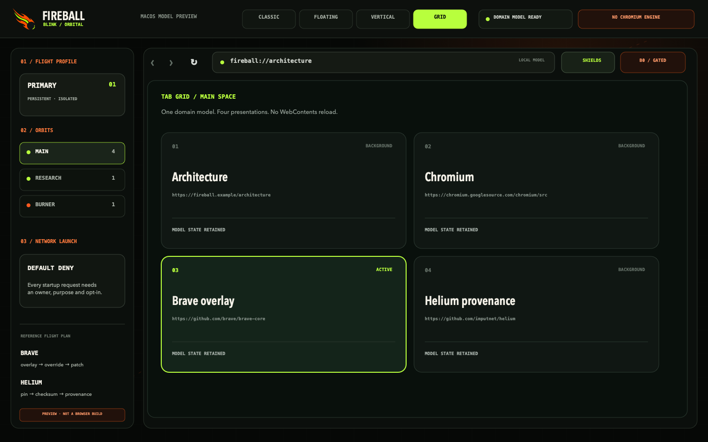
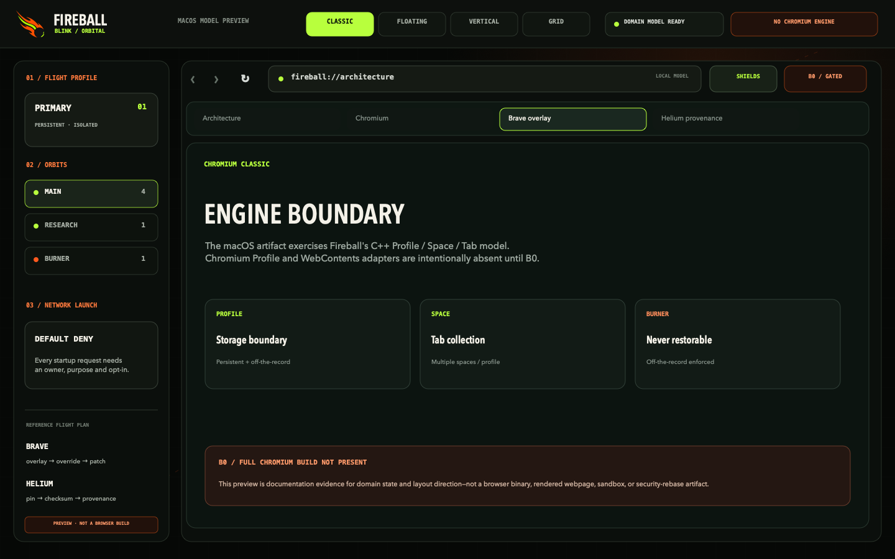
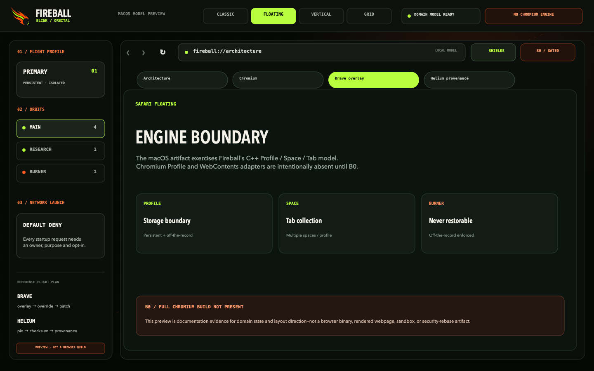
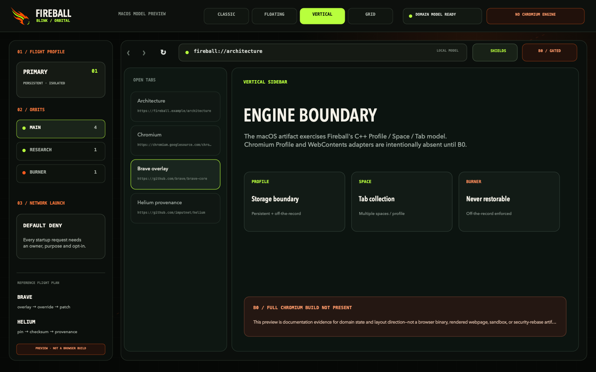

# fireball-blink

Buildable B0/B1 tooling foundation for the Chromium-based Fireball Browser.


The detached meteor mark is the shared Fireball identity: an obsidian core,
ember-orange flight surfaces and one electric-lime trail. Blink applies it to
an **orbital command deck**—dense desktop chrome, explicit Profile/Space
boundaries and visible provenance—without pretending this preview is a browser.



## macOS model preview

The repository includes a buildable AppKit preview that drives its four tab
presentations from the real C++ `BrowserModel`:

| Chromium Classic | Safari Floating |
| --- | --- |
|  |  |
| Vertical Sidebar | Tab Grid |
|  |  |

```sh
make macos-preview
open "out/macos-preview/Fireball Blink Preview.app"
```

This is deliberately a **model/UI preview, not a Chromium browser build**. It
contains no Chromium checkout, WebContents, renderer, sandbox, extensions,
adblock engine, or URL cleaner. The executable and every screenshot repeat that
boundary. See [the reproducible preview and promotion rules](docs/MACOS_PREVIEW.md).

The product-specific UI tokens and component rules live in
[`design-system/fireball-blink/MASTER.md`](design-system/fireball-blink/MASTER.md),
with preview overrides in
[`pages/browser-shell.md`](design-system/fireball-blink/pages/browser-shell.md).
They adapt UI/UX Pro Max guidance to a desktop browser surface while keeping the
Brave overlay order and Helium provenance model visible in the interface.

## Architecture boundary

- Chromium Stable Linux `151.0.7922.169` and `depot_tools` are locked to exact official revisions in `pins/upstream.json`.
- Product code starts in the `fireball/` GN overlay.
- Chromium-relative overrides live in `chromium_src/` only when an overlay seam is insufficient.
- Direct patches are last-resort entries in `patches/manifest.json`.
- Every imported patch must record its source repository/path, HTTPS license URL, exact source commit, exact verified Chromium commit, milestone range, security impact, required tests and SHA-256.
- PartitionAlloc, Chromium's process model and sandbox remain intact.

`make check` validates upstream/reference pins, generated network policy and the patch manifest; exercises apply, reverse, conflict, checksum and path-traversal fixtures; and compiles standalone C++ policy and domain tests. `make macos-preview-media` rebuilds the AppKit preview and deterministically regenerates all four repository screenshots. This repository does not fetch or build Chromium yet. The first full control build still needs a B0 builder with at least 8 cores, 32 GiB RAM and 300 GiB free disk; no Chromium artifact is claimed from this preview lane.

## Brave and Helium reference policy

`pins/reference-browsers.json` records the exact reviewed snapshots. Brave supplies the overlay → override → direct-patch ordering and rebase discipline. Helium supplies the vendor-sorted patch-series, pruning and download-checksum provenance patterns. Fireball does not automatically import either project's patches; every adopted change still needs its own source commit, license, Chromium range, checksum, security review and required tests.

Compiler optimization ideas from Thorium stay in a separate benchmark lane. Generic CPU builds remain the control.

## Startup network policy

`policies/startup_network.json` is default-deny and currently contains no allowed background traffic. `tools/network_policy.py` generates the C++ table used by the overlay and CI rejects stale generated output, unknown schema fields, implicit consent or a default-allow policy. Future services must declare a stable owner, phase, user-visible purpose and explicit opt-in before a rule can be added.

## Security rebase gate

`security/rebases.json` is the evidence ledger for the 72-hour Chromium security-rebase SLA. Passing and failed attempts are both recorded so a failure breaks the consecutive-pass streak. A pass requires ordered release/triage/build/promotion timestamps, a promoted-artifact checksum, completion within 72 hours, and passing control build, overlay build, smoke tests and startup-network audit. `python3 tools/security_rebases.py status` reports the gate; it remains closed until two consecutive real passes are recorded. No placeholder success is checked in.

## Profiles, Spaces and Burner state

`fireball/browser/domain_model.*` establishes the B2 ownership boundary without replacing Chromium objects: Profile owns persistent or off-the-record storage identity, Space owns a tab collection and points to exactly one Profile, and Tab has a stable UUID. Multiple regular Spaces can share a persistent Profile; Burner Spaces require an off-the-record Profile and cannot be restored. The four tab layouts are presentation state, so switching layout preserves every domain tab. Chromium Profile/WebContents adapters and the full isolation test remain blocked on the B0 checkout/build.
