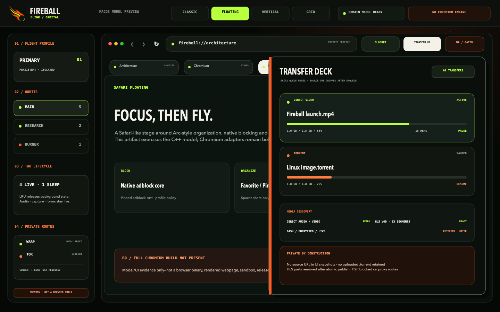

# fireball-blink

Buildable B0/B1 tooling foundation for the Chromium-based Fireball Browser.


The detached meteor mark is the shared Fireball identity: an obsidian core,
ember-orange flight surfaces and one electric-lime trail. Blink applies it to
an **orbital command deck**—dense desktop chrome, explicit Profile/Space
boundaries and visible provenance—without pretending this preview is a browser.




## macOS model preview

The repository includes a buildable AppKit preview that drives its four tab
presentations from the real C++ `BrowserModel`:

| Chromium Classic | Safari Floating |
| --- | --- |
|  |  |
| Vertical Sidebar | Tab Grid |
|  |  |

```sh
make macos-preview
open "out/macos-preview/Fireball Blink Preview.app"
```

This is deliberately a **model/UI preview, not a Chromium browser build**. It
contains no Chromium checkout, WebContents, renderer, sandbox, extensions,
adblock engine, or URL cleaner. The executable and every screenshot repeat that
boundary. See [the reproducible preview and promotion rules](docs/MACOS_PREVIEW.md).

The product-specific UI tokens and component rules live in
[`design-system/fireball-blink/MASTER.md`](design-system/fireball-blink/MASTER.md),
with preview overrides in
[`pages/browser-shell.md`](design-system/fireball-blink/pages/browser-shell.md).
They adapt UI/UX Pro Max guidance to a desktop browser surface while keeping the
Brave overlay order and Helium provenance model visible in the interface.

## Architecture boundary

- Chromium Stable Linux `151.0.7922.169` and `depot_tools` are locked to exact official revisions in `pins/upstream.json`.
- Product code starts in the `fireball/` GN overlay.
- Chromium-relative overrides live in `chromium_src/` only when an overlay seam is insufficient.
- Direct patches are last-resort entries in `patches/manifest.json`.
- `overlay/manifest.json` checksum-pins the complete staged Fireball GN tree; the protected B1 [component-link gate](docs/CHROMIUM_OVERLAY_BUILD.md) refuses unmanaged overrides or stale bytes. The graph now includes [Chromium request adapters](docs/CHROMIUM_NAVIGATION_ADAPTER.md): a Profile-owned policy bundle, primary-main-frame `NavigationThrottle`, sequence-safe subresource `URLLoaderThrottle`, a typed [renderer stylesheet endpoint](docs/CHROMIUM_COSMETIC_ADAPTER.md), its document-scoped async browser transport, BFCache-aware lifecycle owner and acknowledgement-driven controller bridge. Chrome construction remains deliberately inactive until signed production rules and keepalive/prefetch coverage are ready.
- Every imported patch must record its source repository/path, HTTPS license URL, exact source commit, exact verified Chromium commit, milestone range, security impact, required tests and SHA-256.
- PartitionAlloc, Chromium's process model and sandbox remain intact.

`make check` validates upstream/reference pins, the checksum-pinned overlay tree, generated network and URL Cleaner policy data, and the patch manifest; exercises apply, reverse, conflict, checksum and path-traversal fixtures; compiles standalone C++ policy/domain tests; and links the C++ request pipeline to the real Rust blocker ABI. `make macos-preview-media` rebuilds the AppKit preview and deterministically regenerates all five repository screenshots. Normal CI and the preview lane do not fetch Chromium. The guarded [`chromium-control` workflow](docs/CHROMIUM_CONTROL_BUILD.md) performs the exact upstream B0 checkout, generic build, sandboxed local smoke test and immutable evidence packaging only on a protected self-hosted builder, then runs the separately attested [B1 overlay component-link gate](docs/CHROMIUM_OVERLAY_BUILD.md). Neither artifact is claimed until that workflow records a green run on a host with at least 8 cores, 32 GiB RAM and 300 GiB free disk.

## Brave and Helium reference policy

`pins/reference-browsers.json` records the exact reviewed snapshots. Brave supplies the overlay → override → direct-patch ordering and rebase discipline. Helium supplies the vendor-sorted patch-series, pruning and download-checksum provenance patterns. Fireball does not automatically import either project's patches; every adopted change still needs its own source commit, license, Chromium range, checksum, security review and required tests.

Compiler optimization ideas from Thorium stay in a separate benchmark lane. Generic CPU builds remain the control.

## Startup network policy

`policies/startup_network.json` is default-deny and contains no allowed startup traffic. Its post-startup rules cover only user-initiated aria2, WARP and Tor activation, each with explicit consent. `tools/network_policy.py` generates the C++ table used by the overlay and CI rejects stale generated output, unknown schema fields, implicit consent or a default-allow policy. Future services must declare a stable owner, phase, user-visible purpose and explicit opt-in before a rule can be added.

## Security rebase gate

`security/rebases.json` is the evidence ledger for the 72-hour Chromium security-rebase SLA. Passing and failed attempts are both recorded so a failure breaks the consecutive-pass streak. A pass requires ordered release/triage/build/promotion timestamps, a promoted-artifact checksum, completion within 72 hours, and passing control build, overlay build, smoke tests and startup-network audit. `python3 tools/security_rebases.py status` reports the gate; it remains closed until two consecutive real passes are recorded. No placeholder success is checked in.

## Profiles, Spaces and Burner state

`fireball/browser/domain_model.*` establishes the B2 ownership boundary without
replacing Chromium objects: Profile owns persistent or off-the-record storage
identity, Space owns a tab collection and points to exactly one Profile, and
Tab has a stable UUID. Multiple regular Spaces can share a persistent Profile;
Burner Spaces require an off-the-record Profile and cannot be restored.

The Arc-inspired library now implements Profile-wide Favorites, Space-scoped
Pinned tabs, temporary Today tabs, per-Profile auto archive and same-Profile tab
moves. Its lightweight lifecycle ranks safe background discard candidates by
placement and LRU activity while protecting active, audible, capture-active and
unsaved-form tabs. The four layouts are presentation state, so switching layout
preserves every domain tab. See [the tab-management and Chromium adapter
contract](docs/TAB_MANAGEMENT.md).

This is not yet measured Helium-level memory usage. Chromium
Profile/WebContents adapters, a full isolation test and control-vs-overlay
benchmarks remain blocked on the B0 checkout/build.

## Native adblock foundation

`fireball/components/adblock` contains a real, pinned `adblock-rust` 0.13.2
engine behind a panic-contained C ABI plus a C++ per-profile policy boundary.
Network rules, exceptions, third-party matching, site-specific cosmetic rules
and generic class/ID selectors are exercised through the actual engine. The
single-thread feature is selected for this first memory-conscious lane; a
generic build remains the performance control.

The cosmetic path now crosses the native boundary as well: strict C++ decoding
consumes bounded Rust JSON, a Profile-scoped document policy compiles validated
hide selectors into CSS, and a second bounded class/ID phase honors
`$generichide`. Site exemptions disable both phases. Procedural actions and
engine scriptlets are reported as skipped and never executed. A compile-gated
Chromium renderer agent now revalidates the generated CSS and uses Blink's
native user-origin stylesheet API; it contains no HTML or script injection. An
async browser transport now binds the exact active `WeakDocumentPtr` with
renderer epoch, renderer binding-generation and callback-generation checks. A
`DocumentUserData` host keeps the same Fireball document identity through
BFCache, drops the remote while inactive, rebinds idempotently on restore and
rotates identity after a renderer crash. Renderer disconnect/rebind clears both
style layers; the host replays only the last acknowledged document layer and
requires a fresh bounded scan before restoring generic rules. A compile-gated
async controller bridge now
requires an exclusive Profile/Tab/WebContents binding, uses committed Chromium
URLs, rejects stale DOM revisions, retains plans only for BFCache documents and
advances policy state only after renderer acknowledgement. Teardown clears
active/cached styles and failed mutations can reset and rebind. The renderer
now performs an initial bounded light-DOM scan through `WebDocument::All()`,
encodes deduplicated class/ID tokens into a fixed-capacity typed-Mojo payload
and automatically applies the acknowledged generic layer immediately when the
WebDocument reports loaded, otherwise after `DidFinishLoad()` or a five-second
bounded fallback. Revoke and policy refresh cancel an in-flight
scan before mutating styles; malformed renderer payloads fail closed.
Chrome binding/construction, trusted post-load/mutation refresh triggers and
renderer registration remain open. See the
[cosmetic filtering contract](docs/COSMETIC_FILTERING.md).

A document lifecycle controller now binds those style plans to UUID-backed
`DocumentId` and the owning Tab/Profile. It replaces the previous document on
navigation, rejects stale or out-of-order DOM revisions, and revokes both style
layers when a Tab closes or Shields policy changes. Its result DTO exposes only
counts and stable error codes—never URLs, selectors or DOM tokens.

Release engine creation fails closed until Chromium registers its
registry-controlled-domain resolver and a rules artifact passes bounded input,
SHA-256, Ed25519, source provenance, engine-version and minimum-app-version
checks. The unsigned constructor is compiled only for the FFI test feature.
Rules updates will build a replacement immutable engine and swap it at a safe
sequence boundary; they will not mutate an engine serving requests.

`tools/adblock_rules.py` now compiles pinned local EasyList/EasyPrivacy inputs
into a deterministic artifact and signs every security-relevant manifest field,
including artifact URL and source provenance. Its output is loaded by the real
Rust verifier during `make check`; tampered rules, URL, commit or license fail
closed. See the [signed rule artifact contract](docs/ADBLOCK_RULE_ARTIFACTS.md).

## Profile request pipeline

`fireball/components/navigation` now combines strict request validation,
versioned URL cleaning, the per-Profile blocker policy and the committed
Direct/WARP/Tor route into one deterministic decision. Main-frame `GET`
navigations remove exact tracking-parameter names while retaining raw values,
parameter order and fragments. Site exemptions remain inside their Profile.
The adblock path fails closed on a missing engine, malformed result or unknown
flags; only bounded subresource `data:` redirects and same-host, same-scheme
rewrites are accepted.

The built-in parameter table is no longer hand-maintained C++. A strict
first-party data manifest produces a checksum-bound header, while a generated
20-case false-positive corpus executes against the native cleaner. Automatic
imports from Brave, Helium or arbitrary filter sources remain disabled. See the
[URL Cleaner data contract](docs/URL_CLEANER_RULES.md).

The integration gate links these C++ policies to the actual pinned Rust library
and proves block, exception, third-party, exemption, site-specific cosmetic,
generic selector and `$generichide` behavior. See the [request pipeline and
Chromium adapter contract](docs/REQUEST_PIPELINE.md).

This is not yet full Brave Shields or an activated Chromium network/renderer
interceptor. The B0 Chromium integration still needs to wire the Rust target,
register the request throttles and renderer agent, construct the async cosmetic
bridge from the Chrome tab lifecycle, add trusted post-load/mutation triggers
for fresh DOM snapshots, and publish production EasyList/EasyPrivacy commits
with an embedded production key. Until those steps land, the feature is a
tested native foundation rather than a user-visible blocker.

## Download and torrent foundation

`fireball/components/transfer` now contains the first production transfer
vertical slice. It accepts bounded HTTP(S), canonical BitTorrent v1 magnet
links and bounded `.torrent` metainfo; classifies direct audio/video and
HLS/DASH candidates; and controls a foreground aria2 sidecar through typed
JSON-RPC. HTTP transfers use four range connections by default, support
pause/resume and never overwrite an existing file.

The C++ `TransferQueue` gives each job a stable UUID and enforces
Queued/Active/Paused/Complete/Failed/Cancelled transitions. It retains no source
URI or uploaded metainfo after enqueue, keeps terminal states monotonic, redacts
URL/token-bearing backend errors and forgets finished jobs from aria2 only after
the RPC confirms cleanup. The real aria2 integration test drives this queue,
pauses/resumes an 8 MiB ranged download and verifies every output byte.

`MediaDiscovery` adds a bounded, RAM-only per-Tab candidate store for direct
audio/video, HLS and DASH. Public snapshots omit source URLs, each supported
candidate is consumed once, and candidates disappear on Tab cleanup or expiry.
A separate RAM-only `MediaHeaderGrantStore` can bind a one-time,
maximum-60-second request-header capability to one Profile, Tab and candidate.
It accepts only bounded `Authorization`, `Cookie`, `Origin`, `Referer` and
`User-Agent` values; grants are consumed once or destroyed on expiry, Tab close
or Profile removal, and never enter queue snapshots. HLS supports bounded master
playlists plus finite, unencrypted MPEG-TS VOD. DASH supports a deliberately
closed static, single-Period, unencrypted fMP4 subset using `SegmentTemplate`
with duration or `SegmentTimeline`, one selected video representation and
optional audio. Both coordinators retain no URLs or backend GIDs in public state,
remove private artifacts before success, and atomically publish mode-0600 output.
DASH assembles each track locally and invokes a hardened, no-shell FFmpeg
stream-copy mux through pre-opened input descriptors with network and filesystem
input protocols disabled. Live/low-latency streams,
DRM/`ContentProtection`, HLS encryption, HLS byte ranges and unsupported DASH
addressing modes fail closed.

The grant handoff is ready for Chromium's future origin-aware network backend,
but aria2 deliberately rejects every credential-bearing job. A real redirect
probe showed that aria2 1.37.0 forwards custom `Authorization` and `Cookie`
headers across origins and its RPC surface cannot impose the required redirect
policy. Public, credential-free HLS and DASH jobs continue through aria2; private
media must wait for the Chromium adapter rather than risk header disclosure.

The sidecar cannot launch until the network policy observes an explicit user
transfer action, and its RPC binds only to IPv4 loopback. A fresh 256-bit secret is placed
in a mode-0600 file inside a private runtime directory—not in process
arguments—and is unlinked after authenticated RPC becomes ready. Uploaded
torrent metadata is not retained, DHT/LPD/peer exchange and post-download
seeding are disabled in this initial privacy lane, and an ephemeral request is
rejected unless its download directory is a strict descendant of that private
runtime directory. HTTP(S) downloads can consume a verified route's loopback
HTTP CONNECT endpoint. Magnet and `.torrent` requests fail closed on proxied
routes until every peer socket can be proven to stay inside that egress.

`make check` requires `aria2c` 1.37.0 plus FFmpeg/ffprobe major 6–9. It launches
the real sidecar, downloads and byte-verifies an 8 MiB ranged fixture, exercises
pause/resume, and completes HLS and generated fMP4 DASH VOD over both Direct and
loopback HTTP CONNECT. The suite verifies DASH video/audio streams with ffprobe,
asserts that aria2 sends no credential-bearing requests, submits valid torrent
metainfo, checks that no uploaded `.torrent` is retained, and proves clean child
process shutdown. Install dependencies with `brew install aria2 ffmpeg` on macOS
or `apt install aria2 ffmpeg` on Ubuntu. Chromium-side grant minting, the
origin-aware private-media backend and the user-facing Chromium transfer shelf
remain follow-up work. The AppKit preview includes a
deterministic drawer backed by the real queue state machine plus HLS and DASH
parsers, not a production download surface. See [the transfer architecture and
remaining promotion work](docs/TRANSFERS.md).

## WARP and Tor egress foundation

`fireball/components/egress` now defines profile-scoped Direct, WARP and Tor
routes, a transaction controller, a real loopback SOCKS5 readiness probe and an
ephemeral Tor sidecar. WARP is accepted only as a preconfigured Local proxy
after explicit user action; it is labeled encrypted egress rather than
anonymity. Tor gets distinct SOCKS5 and HTTP CONNECT listeners per Profile.

Chromium proxy rules contain no implicit Direct fallback. HTTP(S) downloads are
mapped to the route's HTTP CONNECT listener, while peer-to-peer requests remain
disabled on proxied routes. A native evidence validator now rejects route-mode
or proxy-port mismatch, local DNS activity, direct fallback, missing provider
attestation and non-public probe addresses before a candidate can commit. The
detailed security boundary, external setup and remaining Chromium probe
collector wiring are documented in
[`docs/EGRESS.md`](docs/EGRESS.md).
