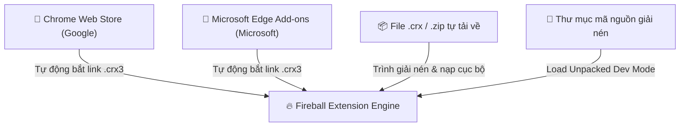

# 🧩 Hướng Dẫn Cài Đặt & Quản Lý Extension Cho Fireball Browser

Fireball Browser hỗ trợ đầy đủ các nguồn tiện ích mở rộng chuẩn **Manifest V3 / V2** từ các kho lưu trữ lớn nhất thế giới:

---

## 🌟 1. Các Nguồn Tải Extension Được Hỗ Trợ



---

## 📥 2. Cách 1: Tải & Cài Đặt Trực Tiếp Từ Chrome Web Store

1. Truy cập trang tiện ích trên [Chrome Web Store](https://chromewebstore.google.com) (Ví dụ: uBlock Origin, Tampermonkey, Dark Reader).
2. Sao chép đường dẫn URL của tiện ích hoặc Extension ID (32 ký tự).
3. **Cách tự động qua công cụ Fireball CLI:**
   ```bash
   python3 tools/extension_installer.py https://chromewebstore.google.com/detail/ublock-origin/cjpalhdlnbpafiamejdnhcphjbkeiagm
   ```
4. Tiện ích sẽ được tự động giải nén và nạp sẵn sàng trong `dist/installed_extensions/`!

---

## 🏢 3. Cách 2: Tải & Cài Đặt Trực Tiếp Từ Microsoft Edge Add-ons

1. Truy cập [Microsoft Edge Add-ons Store](https://microsoftedge.microsoft.com/addons).
2. Sao chép URL tiện ích:
   ```bash
   python3 tools/extension_installer.py https://microsoftedge.microsoft.com/addons/detail/ublock-origin/odfafepnkmbhccpbejgmiehpchacaeak
   ```
3. Công cụ sẽ tự động nhận diện kho Edge, tải file `.crx` chính thức từ máy chủ Microsoft và giải nén.

---

## 📦 4. Cách 3: Tự Nạp File `.crx` hoặc `.zip` Cục Bộ (Sideloading)

Nếu bạn có sẵn file `.crx` hoặc `.zip` của tiện ích từ GitHub hoặc lập trình viên:
1. Đặt file vào máy tính của bạn.
2. Dùng công cụ giải nén:
   ```bash
   python3 tools/extension_installer.py /duong_dan/toi/extension.crx --dest dist/installed_extensions/my_custom_ext
   ```
3. Khởi động Fireball với cờ:
   ```bash
   --load-extension=dist/installed_extensions/my_custom_ext
   ```

---

## 🛠️ 5. Cách 4: Tải Nạp Trực Tiếp Thư Mục Mã Nguồn (Load Unpacked)

Dành cho các tiện ích nội bộ của Fireball hoặc khi bạn đang tự phát triển:
1. Mở trình duyệt và truy cập `chrome://extensions` (hoặc `edge://extensions`, `brave://extensions`).
2. Bật công tắc **Developer mode** (Chế độ nhà phát triển) ở góc phải.
3. Bấm **Load unpacked** (Tải tiện ích đã giải nén).
4. Chọn một trong các thư mục độc lập trong `fireball-extension/`:
   - `fireball-extension/fireball-sync` (Đồng bộ 24 từ BIP-39)
   - `fireball-extension/fireball-shield` (Chống rò WebRTC)
   - `fireball-extension/fireball-tampermonkey` (Trình quản lý UserScript)
   - `fireball-extension/fireball-ublock` (Chặn quảng cáo uBlock Origin)
   - Hoặc `fireball-extension/suite` (Gói tổng hợp toàn bộ).
