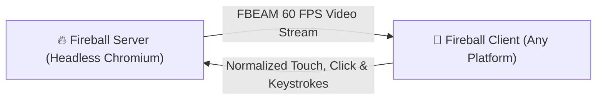

# 📡 Fireball Client (Pure Thin Streaming Client)

**Fireball Client** is an ultra-lightweight, dedicated thin-client application for all platforms whose **sole purpose** is to connect to, display, and interact with a remote [Fireball Server](../fireball-server/) via the low-latency binary `FBEAM` streaming protocol.

---

## 🌟 Architecture & Highlights



| Platform | Target Runtime | Footprint | Primary Features |
|---|---|---|---|
| **🌐 Web / PWA** (`web/`) | Any Modern Browser (Chrome, Safari, Firefox) | Zero install | HTML5 Canvas, WebSockets, Touch/Mouse/Keyboard forwarder |
| **🖥️ Desktop** (`desktop/`) | Windows, macOS, Linux | `< 10MB` | Hardware-accelerated window, multi-monitor, low-latency FBEAM decoder |
| **🤖 Android** (`android/`) | Android Phones, Tablets, Android TV | `< 2MB APK` | Hardware surface view, touch gesture normalizer, QR code pairing |
| **🍎 Apple** (`apple/`) | iOS, iPadOS, macOS, visionOS | `< 5MB App` | SwiftUI Metal/MetalKit renderer, AirPlay support, 6-word pairing |
| **☕ Java ME** (`j2me/`) | Nokia, Symbian, BlackBerry | `< 40KB JAR` | LCDUI Canvas, GPRS 2G/3G tile caching, D-pad mouse pointer |

---

## 🚀 Quick Start & Pairing

1. Start your **Fireball Server**:
   ```bash
   cd fireball-server
   ./start-server.sh --port 9090
   ```
2. Open **Fireball Client** on any device and enter the 6-word phrase or scan the pairing QR code.
3. Enjoy full desktop-class browsing on any device!
