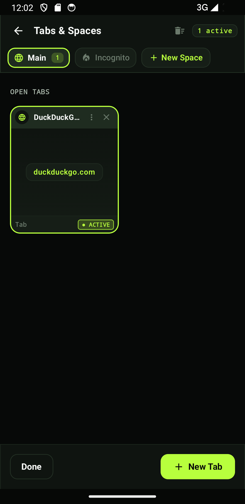
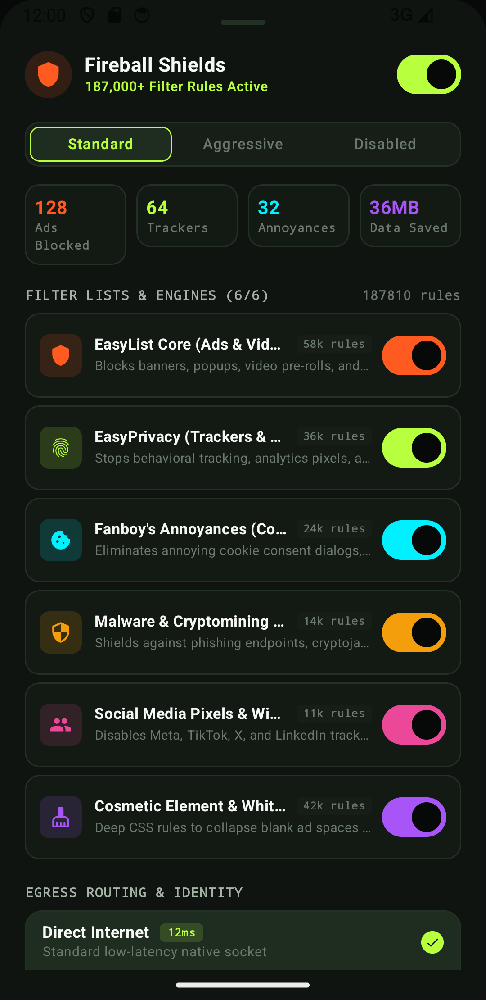
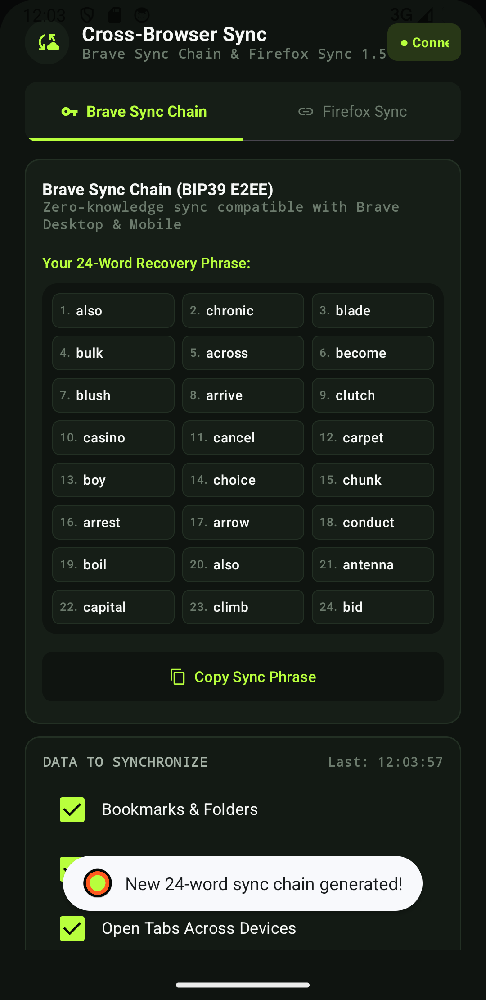
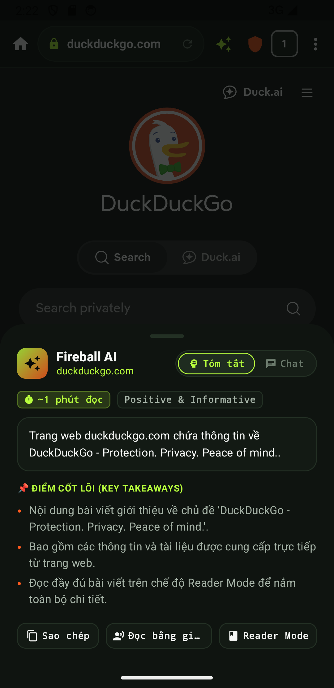
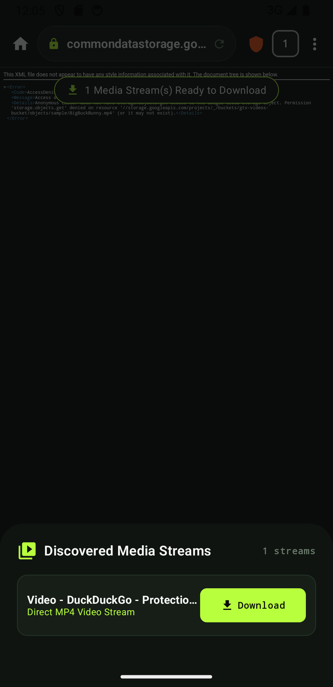
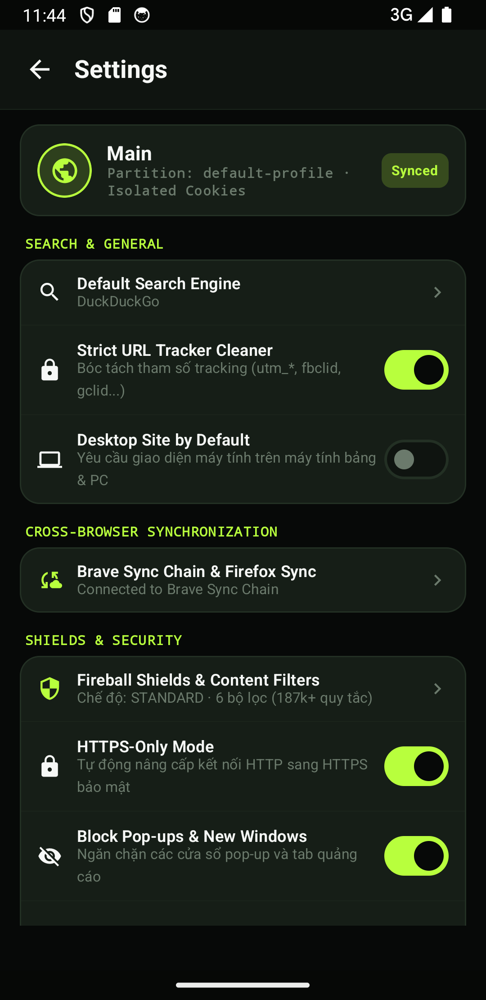
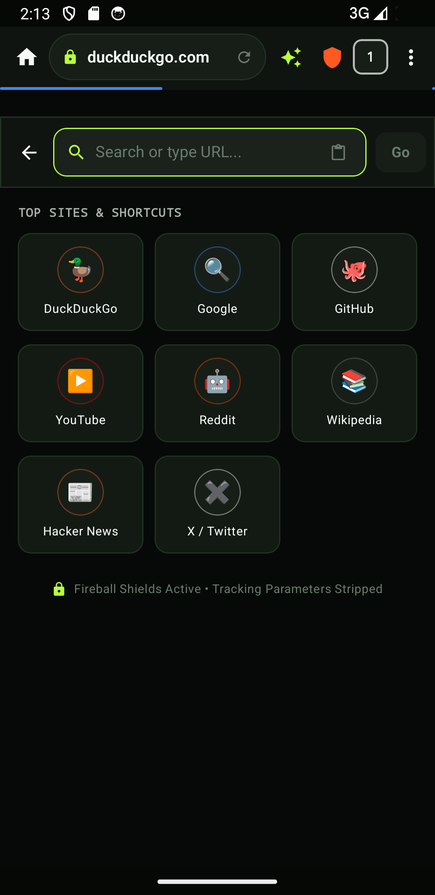
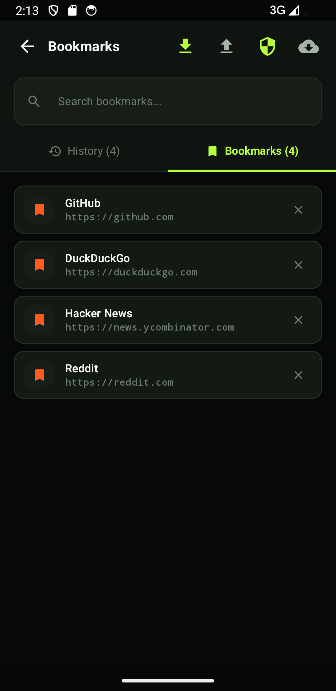

# Fireball Mini for Android 🚀

**Fireball Mini** là phiên bản di động siêu nhẹ, tối ưu trải nghiệm và bảo mật của Fireball Browser dành cho hệ điều hành Android (hỗ trợ từ Android 8.0 / API 26 đến Android 15 / API 35). Ứng dụng kết hợp giao diện hiện đại **Jetpack Compose / Material Design 3 (Material You)** với tầng lõi bảo mật hiệu năng cao **C++ / Rust (Android NDK)**.

---

## 📸 Hình Ảnh Giao Diện Thực Tế (Live Screenshots)

| 🪐 Quản lý Spaces & Tab Tray | 🛡️ Bộ Chặn Quảng Cáo & Shields |
| :---: | :---: |
|  |  |
| **Spaces, Favorites, Pinned & Today Tabs** | **Rust Adblocker, Cosmetic Filters & Inset Safe** |

| 🔄 Đồng Bộ Đa Trình Duyệt (Firefox/Brave) | 🤖 Trợ Lý Fireball AI & Reader Mode |
| :---: | :---: |
|  |  |
| **24-Word BIP39 Chain & E2EE Key Derivation** | **Key Takeaways, Summary & Multi-Turn Chat** |

| 🎬 Bắt Link Media & Video Downloads | ⚙️ Cài Đặt & Cấu Hình Nâng Cao |
| :---: | :---: |
|  |  |
| **HLS / DASH Streams & Chọn chất lượng** | **M3 Touch Targets, Privacy & Sync Settings** |

| 🔍 Thanh Tìm Kiếm & Top Sites Grid | 📑 Quản Lý Dấu Trang & Sao Lưu E2EE |
| :---: | :---: |
|  |  |
| **Top Sites, Gỡ tham số theo dõi URL** | **HTML Netscape Import/Export & AES-GCM Backup** |

---

## 🌟 Tính Năng Nổi Bật

### 1. Quản lý Tab Đa Tầng (Orbital Deck Model)
- **Spaces & Profiles:** Phân chia không gian làm việc (Personal, Work, v.v.) và hồ sơ lưu trữ cookie tách biệt hoàn toàn.
- **3 Cấp độ lưu trữ Tab:**
  - **⭐ Favorites:** Tab ưa thích gắn với Profile, xuất hiện trên mọi Space.
  - **📌 Pinned Tabs:** Tab ghim cố định trong từng Space.
  - **🕘 Today Tabs:** Tab lướt web hàng ngày, tự động dọn dẹp và lưu trữ (Auto-Archive).
- **🔥 Burner Space:** Chế độ ẩn danh nghiêm ngặt (Off-the-record), tự hủy sạch dữ liệu và cache ngay khi đóng.
- **💤 Tiết kiệm RAM thông minh (LRU Discard):** Đưa các tab ngầm không hoạt động vào trạng thái ngủ khi hệ thống thiếu RAM.

### 2. Bộ Chặn Quảng Cáo & Quyền Riêng Tư (Fireball Shields)
- Chặn quảng cáo, theo dõi và mã độc tại tầng mạng qua FFI / C++ Native Bridge (`adblock-rust` 0.13.2).
- **Cosmetic Filtering:** Tự động ẩn các khung trống quảng cáo (Ad placeholders) mà không làm vỡ giao diện website.
- **Strict URL Cleaner:** Tự động loại bỏ các tham số theo dõi chiến dịch (`utm_source`, `utm_campaign`, `fbclid`, `gclid`, `ref`, v.v.).
- **6 Bộ Lọc Tùy Chỉnh:** Trình chặn Tracker, Nâng cấp HTTPS, Chống nhận dạng vân tay (Anti-Fingerprinting), Lọc thẩm mỹ, Chặn Script, và Cô lập Cookie bên thứ ba.

### 3. Đồng Bộ Đa Trình Duyệt (Cross-Browser Sync - Firefox & Brave Parity)
- **Chuỗi Mật Mã 24 Từ (BIP-39):** Tạo chuỗi khóa khôi phục 24 từ chuẩn xác.
- **Tương Thích Firefox & Brave Sync:** Hỗ trợ phái sinh khóa đồng bộ bằng thuật toán PBKDF2 / SHA-256 HKDF.
- **Mã Hóa Đầu Cuối (E2EE):** Xuất / nhập dữ liệu Bookmark và Tab mã hóa AES-GCM-256 có mật khẩu bảo vệ.
- **Chuẩn Dấu Trang Netscape HTML:** Nhập và xuất Bookmark tương thích 100% với Chrome, Brave và Firefox.

### 4. Trợ Lý AI & Chế Độ Đọc Không Xao Nhãng (Fireball AI & Reader Mode)
- **Tóm Tắt & Điểm Cốt Lõi:** Tự động bóc tách bài viết trên trang bằng engine Readability nội bộ, tạo tóm tắt nhanh và ước tính thời gian đọc.
- **Trò Chuyện Đa Lượt (AI Chat):** Hỏi đáp trực tiếp về nội dung bài viết với trợ lý ảo.
- **Chế Độ Đọc Tinh Gọn (Reader Mode):** Giao diện đọc sách thanh lịch, tùy biến cỡ chữ, phông chữ và giao diện tối/sáng.
- **Đọc Văn Bản Bằng Giọng Nói (Text-to-Speech):** Trình phát âm thanh nổi tích hợp với tùy chỉnh tốc độ từ 0.75x đến 2.0x.

### 5. Bắt Link Media & Tải Tệp Thông Minh (Media Sniffer)
- **Tự Động Phát Hiện Luồng:**
  - **HLS Adaptive Streams (`.m3u8`)**
  - **DASH Streams (`.mpd`)**
  - **Direct MP4 / WebM / MP3 / OGG**
- **Chọn Chất Lượng Video:** Lựa chọn độ phân giải và bitrate trước khi tải.
- **Transfer Deck:** Hàng đợi tải đa luồng với khả năng Tạm dừng / Tiếp tục (Pause/Resume).

### 6. Định Tuyến & Bảo Mật Egress
- Hỗ trợ chuyển đổi nhanh giữa:
  - **Direct Internet:** Kết nối mạng chuẩn.
  - **Cloudflare WARP:** Mã hóa luồng dữ liệu di động.
  - **Tor Onion Circuit:** Ẩn danh nâng cao theo từng Profile qua SOCKS5 proxy.

### 7. Thiết Kế Chuẩn Google Material Design 3 & Tương Thích Đa Thiết Bị
- **Material You (M3):** Màu sắc thích ứng, bo góc thẻ đồng bộ, vùng chạm phím đạt chuẩn công thái học ($\ge 48\text{dp}$).
- **Safe System Insets:** Xử lý triệt để đệm thanh điều hướng và thanh trạng thái (`navigationBarsPadding()`, `statusBarsPadding()`).
- **Giao Diện Máy Tính Bảng & PC:** Hỗ trợ thanh Tab máy tính bảng chuyên dụng (**Tablet Tab Strip**), chế độ Desktop Site và đa cửa sổ.

---

## 🏗️ Cấu Trúc Dự Án

```
fireball-mini/
├── app/
│   ├── build.gradle.kts           # Cấu hình Gradle & NDK CMake
│   ├── src/
│   │   ├── main/
│   │   │   ├── cpp/               # C++ JNI Native Core Bridge
│   │   │   │   ├── CMakeLists.txt
│   │   │   │   ├── fireball_jni.cc
│   │   │   │   └── jni_helpers.h
│   │   │   ├── java/com/fireball/mini/
│   │   │   │   ├── MainActivity.kt
│   │   │   │   ├── FireballApp.kt
│   │   │   │   ├── core/          # Native Bridge, Sync, Security, Transfers & Models
│   │   │   │   ├── data/          # Repositories & State Handlers
│   │   │   │   └── ui/            # Jetpack Compose UI (Screens, Theme, Components)
│   │   │   └── res/               # Resources, Icons & Styles
│   │   └── test/                  # Unit Tests (42/42 tests passing)
│   │       └── java/com/fireball/mini/
│   │           ├── SyncCryptoTest.kt
│   │           ├── BookmarksHtmlExporterTest.kt
│   │           ├── DomainModelTest.kt
│   │           ├── UrlCleanerTest.kt
│   │           ├── MediaSnifferTest.kt
│   │           └── ReaderModeExtractorTest.kt
├── build.gradle.kts
└── settings.gradle.kts
```

---

## 🔨 Hướng Dẫn Biên Dịch & Cài Đặt

### Yêu cầu:
- **Android SDK 35** (Android 15) & Min SDK 26 (Android 8.0+)
- **Android NDK** (Side by side 25+) & CMake 3.22.1+
- **JDK 17+**

### Lệnh thực thi:
```bash
cd fireball-mini

# Chạy toàn bộ 42 Unit Tests
./gradlew testDebugUnitTest

# Biên dịch APK Debug
./gradlew assembleDebug

# Cài đặt và khởi chạy lên thiết bị / Emulator đã kết nối
./gradlew installDebug
adb shell am start -n com.fireball.mini/.MainActivity
```
File APK đầu ra nằm tại: `app/build/outputs/apk/debug/app-debug.apk`.
