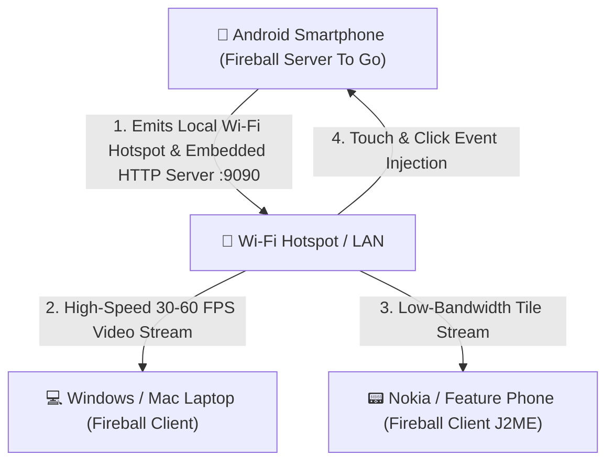

# 🎒 Fireball Server To Go (Pocket Android Server)

**Fireball Server To Go** turns any Android smartphone or tablet into a **portable, battery-powered Fireball Server** that you can take anywhere.

---

## 🌟 How It Works

---

## 🚀 Key Highlights & Capabilities

| Feature | Description |
|---|---|
| **Pocket Portability** | Run a full streaming browser server directly from your pocket with zero external PC or cloud server required. |
| **Hotspot Zero-Config** | Works completely offline or over cellular 4G/5G mobile hotspot. |
| **Off-Screen Web Engine** | Renders modern heavy websites on the Android device hardware and streams lightweight compressed frames to client devices. |
| **Low-Battery Background Daemon** | Optimized Foreground Service with Android CPU wake-lock and battery-aware thermal throttling. |
| **Instant QR / 6-Word Pairing** | Displays a live QR code and 6-word mnemonic on the host Android screen for 1-second client pairing. |
| **Multi-Client Multiplexing** | Stream simultaneously to multiple thin clients (e.g. tablet + laptop + retro phone). |

---

## 📱 Quick Usage Guide

1. Open **Fireball Mini** or **Fireball Server To Go** on your Android phone.
2. Tap **Start Server To Go** (Bật Máy Chủ Di Động).
3. The app will display your local IP (e.g., `http://192.168.43.1:9090`) and a Pairing QR Code.
4. On your client device (Nokia J2ME phone, laptop, or iPad), connect to the phone's Wi-Fi hotspot, open **Fireball Client**, and scan the QR code!
